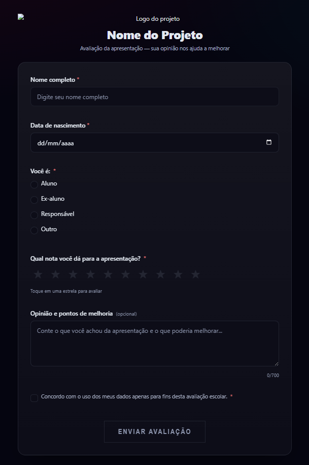
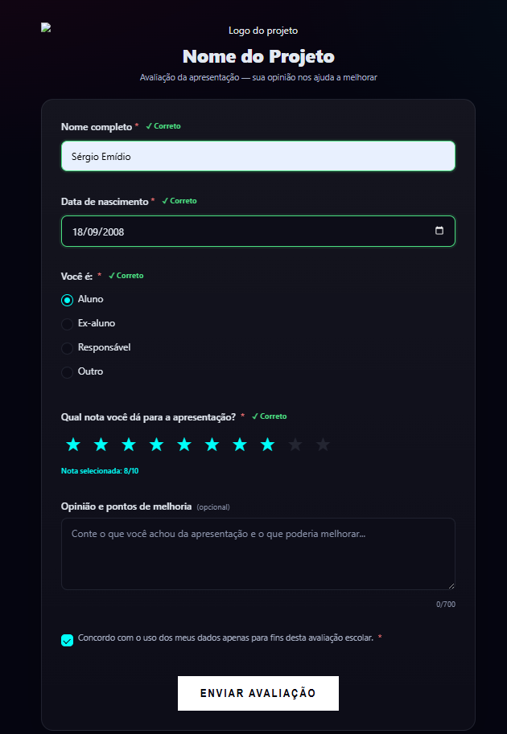

<div align="center">

# 📊 RefMap — Sistema de Avaliação e Feedback de Projetos


Sistema web moderno, responsivo e altamente estilizado desenvolvido para a coleta, segurança e análise inteligente de avaliações de apresentações escolares. O projeto resolve problemas clássicos de usabilidade de formulários web, protege áreas administrativas com criptografia avançada e transforma dados brutos em inteligência visual através de um dashboard completo.

</div>

---

## 📸 Demonstração Visual do Sistema

<p align="center"><b>1. Formulário de Avaliação (Estado Inicial Limpo)</b></p>
<p align="center">
  
</p>

<p align="center"><b>2. Validação Reativa em Tempo Real e Feedback Visual por Campo</b></p>
<p align="center">
  
</p>

<p align="center"><b>3. Tela de Login do Dashboard (Segurança de Acesso Restrito)</b></p>
<p align="center">
  
</p>

<p align="center"><b>4. Resiliência de Rede: Tratamento Inteligente de Conexão (Servidor Offline)</b></p>
<p align="center">
  
</p>
---

## 🛑 O Problema: Formulários Comuns vs. A Abordagem do RefMap

Muitos formulários web desenvolvidos de forma amadora ou "de qualquer jeito" sofrem de falhas críticas que prejudicam a experiência do usuário e a integridade dos dados coletados. O **RefMap** foi desenhado arquiteturalmente para combater cada uma dessas dores:

| Dores de Formulários Comuns ❌ | Como o RefMap Resolve Isso ✅ |
| :--- | :--- |
| **Falta de feedback visual:** O usuário clica em enviar, a página recarrega e ele descobre um erro sem saber onde errou. | **Validação em Tempo Real & Estados:** O front-end valida nome, data de nascimento e seleções instantaneamente, exibindo selos claros de `✓ Correto` ou alertas visuais antes mesmo do envio. |
| **Perda de dados por instabilidade:** Se a API cai ou a internet oscila no clique final, o usuário perde tudo o que digitou. | **Resiliência e Modais de Estado:** O sistema conta com interceptadores de requisição e um modal dedicado de **Servidor Offline** que preserva o estado da tela, permitindo tentar o envio novamente sem redigitar nada. |
| **Campos rígidos e não intuitivos:** Perguntas sobre o perfil do avaliador travam se a opção exata não estiver listada. | **Campos Dinâmicos Condicionais:** A escolha de perfis lida com opções customizáveis (como o campo extra animado para a opção "Outro"). |
| **Ausência de limites de texto:** Campos de opinião livres geram textos gigantescos desestruturados ou dados corrompidos. | **Contadores Regressivos de Caracteres:** A caixa de texto de feedback possui limite estrito de 700 caracteres com feedback numérico visual em tempo real (`0/700`). |

---

## 🔐 O Problema do Login e Como Ele É Resolvido

### O Desafio
Permitir que apenas o administrador visualize dados sensíveis de avaliação sem expor a API a invasões, força bruta, interceptações de sessão ou vazamento de credenciais em texto plano.

### A Solução Implementada no Back-end (`app/login.py`)
1. **Criptografia de Senha com Bcrypt (`passlib`):** O sistema nunca armazena senhas em texto puro. O script utilitário `gerar_hash.py` converte a senha original em um hash irreversível complexo gravado de forma segura nas variáveis de ambiente (`.env`).
2. **Defesa contra Timing Attacks:** Ao validar o login, o algoritmo executa a verificação de hash mesmo que o nome de usuário esteja incorreto, mitigando ataques de variação de tempo de resposta.
3. **Autenticação Baseada em Tokens (JWT - JSON Web Tokens):** - Ao enviar credenciais válidas para `/login`, o servidor gera um token criptografado digitalmente com tempo de expiração estipulado (ex: 2 horas).
   - O front-end armazena esse token na sessão (`sessionStorage`) e o injeta automaticamente no cabeçalho das requisições subsequentes via injetores de dependência (`HTTPBearer`).
   - Se o token expirar ou for inválido, o acesso às rotas restritas e ao dashboard é bloqueado imediatamente.

---

## 📈 O Dashboard: Arquitetura Analítica Completa

O painel de controle administrativo (`dashboard.html` / `dashboard.js`) foi estruturado para deixar de ser um painel simplista e se tornar uma central completa de inteligência de dados do evento.

### Estrutura de Métricas do Dashboard
* **Métricas Gerais (Cards de Resumo - `resumoService.js`):**
  - Total geral de avaliações coletadas.
  - Média geral de satisfação da instituição / evento (calculada com base nas notas dadas de 1 a 10).
  - Apresentação e sala com maior destaque e volume de avaliações.
* **Visualização Gráfica Dinâmica (`grafico.js`):**
  - Gráficos comparativos de desempenho por sala ou projeto.
  - Distribuição estatística das notas (quantos alunos deram nota 10, nota 8, etc.).
  - Gráfico de pizza/rosca demonstrando o perfil dos avaliadores (Percentual de Alunos vs. Ex-alunos vs. Responsáveis vs. Outros).
* **Painel de Listagem de Respostas (`respostasService.js`):**
  - Tabela filtrável e paginada contendo o histórico detalhado de cada feedback enviado.
  - Opções de exportação rápida dos dados consolidados para formato de planilha (`planilha.py`).

---

## 📂 Estrutura Real de Pastas do Projeto

```text
Feedback - orgulho/
│
├── Back-end/                      # Servidor e API (FastAPI)
│   ├── app/
│   │   ├── routers/               # Endpoints da API modularizados
│   │   │   ├── qrcode.py          # Geração de QR Code para acesso rápido
│   │   │   ├── respostas.py       # Registro, validação e listagem das avaliações
│   │   │   ├── resumo.py          # Processamento de métricas consolidadas para o dashboard
│   │   │   └── salas.py           # Gestão de salas e projetos avaliados
│   │   ├── utils/
│   │   │   ├── gerar_hash.py      # Script de segurança para criação de hash Bcrypt e JWT
│   │   │   └── planilha.py        # Motor de exportação de dados analíticos
│   │   ├── database.py            # Configuração do ORM e conexão com banco de dados
│   │   ├── login.py               # Lógica de emissão de tokens JWT e segurança de rotas
│   │   ├── main.py                # Inicializador central da aplicação FastAPI
│   │   ├── models.py              # Definição das tabelas do banco de dados (SQLAlchemy)
│   │   └── schemas.py             # Modelos de validação de carga de dados (Pydantic)
│   ├── venv/                      # Ambiente virtual isolado Python
│   ├── .env                       # Variáveis de ambiente sensíveis (Chaves e Hashes)
│   ├── .gitignore                 # Arquivos ignorados pelo Git
│   └── requirements.txt           # Dependências completas do back-end
│
└── docs/                          # Front-end da aplicação (Interface Web Estática)
    ├── assets/                    # Repositório de imagens e capturas de tela do sistema
    ├── css/                       # Design System modularizado
    │   ├── base/                  # Reset global, tipografia fluida (clamp) e tokens/variáveis
    │   ├── components/            # Elementos visuais isolados (botões, cards, inputs, modais)
    │   └── pages/                 # Estilos específicos de layout (dashboard, form, login)
    ├── js/                        # Scripts dinâmicos baseados em módulos ES6+
    │   ├── components/            # Controladores de UI (gráficos, pop-ups, indicador de carregamento)
    │   ├── pages/                 # Lógica de controle de página (form.js, login.js, dashboard.js)
    │   ├── services/              # Camada de integração assíncrona com a API (fetch wrappers)
    │   └── utils/                 # Formatadores e validadores de regras de negócio locais
    ├── dashboard.html             # Painel administrativo de visualização de métricas e gráficos
    ├── index.html                 # Página principal interativa de coleta de feedback
    └── login.html                 # Página de autenticação segura do administrador